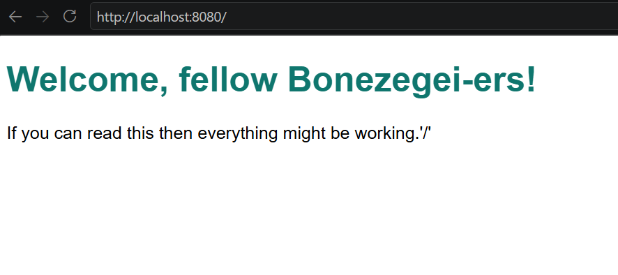
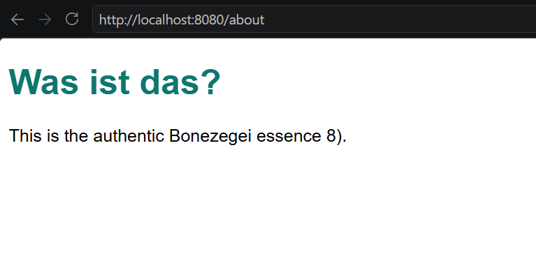
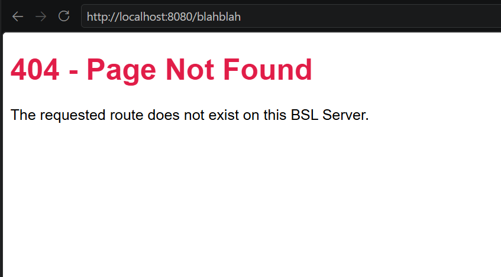
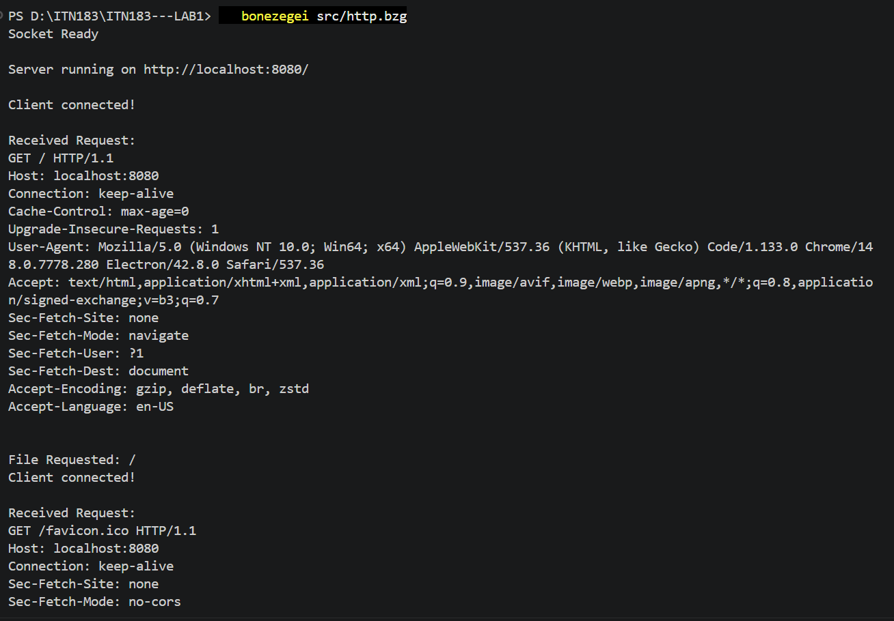

# Big Beautiful Bonezegei BSL HTTP Server

## Project Description

This project features a lightweight HTTP server developed using the Bonezegei Scripting Language (BSL) and its native socket library. Created to fulfill the requirements for **Lab 1: Building an HTTP Server using Socket** taught by the goat, Sir Jofel Batutay. The application processes raw HTTP requests entirely from scratch rather than relying on a pre-built web framework. The server manually handles core networking tasks, including socket creation, port binding, connection listening, request parsing, and response generation.

Operating on port `8080`, the server is configured to handle three distinct endpoints:
- `/` — The root homepage
- `/about` — The about page
- Any unmapped route (e.g., `/test`) — A custom 404 Not Found error page

## Installation & Setup Guide

1. **Install the BSL Interpreter:** Open VS Code, navigate to the Extensions tab, search for "Bonezegei," and install the **Bonezegei Scripting Language Formatter**. The extension includes OS-specific instructions for setting up the core interpreter. *(Note: Windows and Linux users can follow the guide directly; Mac/Android users should utilize GitHub Codespaces following the Linux steps).*
2. **Clone the Repository:** Open your terminal and pull the project locally into VS Code:
   ```bash
   git clone https://github.com/divineongue-sys/my-bsl-http-server.git
   cd my-bsl-http-server
   ```
3. **Install Dependencies:** Download the required socket library using the BSL package manager:
   ```bash
   bzg install socket
   ```
4. **Start the Server:** Execute the main server script:
   ```bash
   bonezegei src/http.bzg
   ```
   Upon a successful launch, your terminal will display `"Socket Ready"` and `"Server running on http://localhost:8080/"`.

## Usage Instructions

Once the server is actively running, open your web browser and navigate to the following URLs to test the routing mechanism:

- `http://localhost:8080/` — Loads the default homepage.
- `http://localhost:8080/about` — Loads the about page.
- `http://localhost:8080/random-path` — Triggers the 404 error page indicating the route doesn't exist.

*Note: You can monitor all incoming HTTP requests in real-time by checking the server terminal logs.*

## Screenshots

All reference images demonstrating the application's functionality are stored in the `documentation` directory.

**Homepage (`/`)**


**About Page (`/about`)**


**Unknown Route (404 Error Page)**


**Active Server Terminal** (Showing active logs and directory path)
